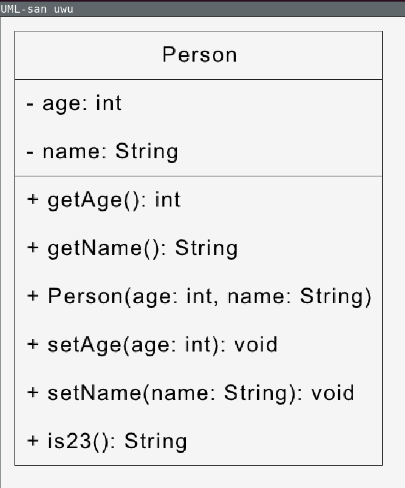

# UML-san
A UML-diagram renderer written in rust that receives java code as input.

# Quick Start
For the font, you can put a file called 'font.ttf' into the root directory. For some reason, the Raylib font loader does not produce an error when the file does not exist, so including no such
file will not produce any errors and raylib will fall back to the standard font.

```console
$ cargo run
```


